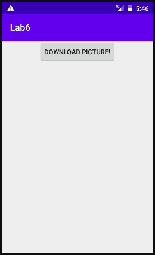
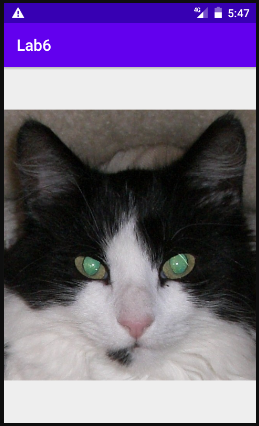

# Лабораторная работа №6. Многопоточные Android приложения.
## Цели:
Получить практические навыки разработки многопоточных приложений:
1. Организация обработки длительных операций в background (worker) thread:
    * Запуск фоновой операции (coroutine/asynctask/thread)
    * Остановка фоновой операции (coroutine/asynctask/thread)
2. Публикация данных из background (worker) thread в main (ui) thread.

Освоить 3 основные группы API для разработки многопоточных приложений:
1. Kotlin Coroutines
2. AsyncTask
3. Java Threads

## Задачи:
### Задача 1. Альтернативные решения задачи "не секундомер" из Лаб. 2.
Моё задание - разработать альтернативные "не секундомеры" из лабораторной работы №2. Всего я прдеставлю три решения: через потоки Java, через AsyncTask и через корутины Kotlin'а. Во всех реализациях layout-файл был взят из Lab2 неизменным.

Начну с листинга Activity, реализующего функцианал через потоки:
```
class MainActivity : AppCompatActivity() {
    var secondsElapsed: Int = 0
    val SECONDS = "0"

    var backgroundThread: Thread? = null

    override fun onResume() {
        super.onResume()
        Log.w("T","Thread running")
        backgroundThread = Thread {
            try {
                while (!Thread.currentThread().isInterrupted) {
                    Thread.sleep(1000)
                    textSecondsElapsed.post {
                        textSecondsElapsed.text = "Seconds elapsed: " + secondsElapsed++
                    }
                }
                return@Thread
            } catch (e: InterruptedException) {
                Thread.currentThread().interrupt()
                return@Thread
            }
        }
        backgroundThread!!.start()
    }

    override fun onPause() {
        backgroundThread?.interrupt()
        super.onPause()
    }

    override fun onSaveInstanceState(outState: Bundle) {
        super.onSaveInstanceState(outState)
        outState.putInt(SECONDS, secondsElapsed)
    }

    override fun onRestoreInstanceState(savedInstanceState: Bundle) {
        super.onRestoreInstanceState(savedInstanceState)
        secondsElapsed = savedInstanceState.getInt(SECONDS)
    }

    override fun onCreate(savedInstanceState: Bundle?) {
        super.onCreate(savedInstanceState)
        setContentView(R.layout.activity_main)
    }

}
```

"Оригинальное" приложение пришлось существенно изменить, я избавился от переменной 'doCount', и вместо неё я в onPause() я прерываю (interrupt()) поток. Но и этого не достаточно; по своей сути это просто выставляет флаг isInterrupted в состояние 'true'. Поэтому этот флаг стал условием выхода из бесконечного цикла, в котором происходит счёт. Кроме того, в случае, если поток будет прерван во время сна, произойдёт InterruptedException, для чего был добавлен обработчик.

Далее, перейдём к листингу реализации через устаревший AsyncTask:
```
class AsyncTask : AppCompatActivity() {
    var secondsElapsed: Int = 0
    val SECONDS = "0"
    lateinit var countingTask: Counter

    override fun onCreate(savedInstanceState: Bundle?) {
        super.onCreate(savedInstanceState)
        setContentView(R.layout.activity_main)
    }

    override fun onResume() {
        super.onResume()
        Log.w("A","AsyncTask running")
        countingTask = Counter()
        countingTask.execute()
    }

    override fun onPause() {
        countingTask.cancel(true)
        super.onPause()
    }

    override fun onSaveInstanceState(outState: Bundle) {
        super.onSaveInstanceState(outState)
        outState.putInt(SECONDS, secondsElapsed)
    }

    override fun onRestoreInstanceState(savedInstanceState: Bundle) {
        super.onRestoreInstanceState(savedInstanceState)
        secondsElapsed = savedInstanceState.getInt(SECONDS)
    }

    inner class Counter : AsyncTask<Void?, Void?, Void?>() {
        override fun onPreExecute() {
            super.onPreExecute()
            textSecondsElapsed.text = "Second elapsed: $secondsElapsed"
        }

        override fun doInBackground(vararg voids: Void?): Void? {
            while(!isCancelled) {
                TimeUnit.SECONDS.sleep(1)
                publishProgress()
            }
            return null
        }

        override fun onProgressUpdate(vararg values: Void?) {
            super.onProgressUpdate(*values)
            textSecondsElapsed.text = "Second elapsed: " + secondsElapsed++
        }
    }
}
```

Здесь вся логика была перенесена в класс Counter, унаследованный от AsyncTask. Метод onPreExecute() выполняется перед doInBackground() и в данном случае используется для задания начального значения таймера после возобновления Activity. В методе doInBackground() проходят основные расчёты, и до отмены (с помощью унаследованного флага isCancelled, я бы назвал его некоторым аналогом isInterrupted) каждую секунду публикуем свой результат. Наконец, onProgressUpdate(), имеющий доступ к UI, инкрементирует значение счётчика.

Листинг третьего решения, через KotlinCoroutines:
```
class Corutines : AppCompatActivity() {
    var secondsElapsed: Int = 0
    val SECONDS = "0"
    lateinit var countingJob: Job

    override fun onCreate(savedInstanceState: Bundle?) {
        super.onCreate(savedInstanceState)
        setContentView(R.layout.activity_main)
    }

    override fun onResume() {
        super.onResume()
        Log.w("C","Corutines running")
        textSecondsElapsed.text = "Second elapsed: " + secondsElapsed
        countingJob = CoroutineScope(Dispatchers.Main).launch {
            while (true) {
                delay(1000)
                textSecondsElapsed.text = "Second elapsed: " + secondsElapsed++
            }
        }
    }

    override fun onPause() {
        countingJob.cancel()
        super.onPause()
    }

    override fun onSaveInstanceState(outState: Bundle) {
        super.onSaveInstanceState(outState)
        outState.putInt(SECONDS, secondsElapsed)
    }

    override fun onRestoreInstanceState(savedInstanceState: Bundle) {
        super.onRestoreInstanceState(savedInstanceState)
        secondsElapsed = savedInstanceState.getInt(SECONDS)
    }
}
```

Корутины являются "обёрткой" над потоками и более просты в использовании. В onResume() запускается корутина, отвечающая за счёт. Она представляет из себя бесконечный цикл, остановить который можно только вместе с отменой самой корутины. Это мы и делаем с помощью countingJob.cancel() в onPause().

### Задача 2. Загрузка картинки в фоновом потоке (AsyncTask).
Передо мной стоит задача создать приложение с применением AsyncTask, которое скачает картинку из Интернета и выведет её на экран.

Листинг Activity:
```
class AsyncPic : AppCompatActivity() {
    lateinit var downloadingTask: Downloader

    override fun onCreate(savedInstanceState: Bundle?) {
        super.onCreate(savedInstanceState)
        setContentView(R.layout.activity_async_pic)
        Log.w("AP","Async Downloading")
        button.setOnClickListener {
            downloadingTask = Downloader()
            downloadingTask.execute("https://upload.wikimedia.org/wikipedia/commons/0/0d/Reflexion_der_Augen_einer_Katze.JPG")
        }
    }

    inner class Downloader : AsyncTask<String?, Void?, Bitmap?>() {
        override fun doInBackground(vararg urls: String?): Bitmap? {
            var pic: Bitmap? = null
            try {
                val input: InputStream = URL(urls[0]).openStream()
                pic = BitmapFactory.decodeStream(input)
            } catch(e: Exception) {
                e.printStackTrace()
                Log.e("NP", "Downloading problem")
            }
            return pic
        }

        override fun onPostExecute(result: Bitmap?) {
            super.onPostExecute(result)
            imageView.setImageBitmap(result)
        }
    }
}
```

Листинг activity_async_pic:
```
<?xml version="1.0" encoding="utf-8"?>
<LinearLayout xmlns:android="http://schemas.android.com/apk/res/android"
    xmlns:app="http://schemas.android.com/apk/res-auto"
    xmlns:tools="http://schemas.android.com/tools"
    android:layout_width="match_parent"
    android:layout_height="match_parent"
    android:orientation="vertical"
    android:layout_gravity="center"
    tools:context=".AsyncPic">
    <ImageView
        android:id="@+id/imageView"
        android:layout_width="match_parent"
        android:layout_gravity="center"
        android:layout_height="wrap_content" />

    <Button
        android:id="@+id/button"
        android:layout_width="wrap_content"
        android:layout_height="wrap_content"
        android:layout_gravity="center"
        android:text="Download picture!" />
```

В AndroidManifest.xml было добавлено разрешение на доступ к сети Интернет:
`<uses-permission android:name="android.permission.INTERNET"/>`
Без него приложение вылетит при попытке нажать на кнопку с java.lang.SecurityException: Permission denied (missing INTERNET permission?). Аналогично, при отсутствии сети получаем вылет из приложения с сообщением E/AndroidRuntime: FATAL EXCEPTION: AsyncTask #1.
Поэтому я дополнительно добавил обработчик исключений - при загрузке данных с Интернета многое может случиться.

У Downloader, в отличие от Counter'а, указаны типы входных (строка - URL картинки) и выходных данных (изображение Bitmap). В самом Downloader'е, в doInBackground(), я создаю объект URL, открываю входной поток, создаю на его основе изображение и возвращаю результат. Метод onPostExecute() помещает картинку в imageView. 

В подтверждение работоспособности приведу скриншоты, соответственно до нажатия кнопки и после:





Как можно видеть, приложение действительно работает. Следует также отметить, что в данном приложении изображение не переживает пересоздание Activity и его придётся скачивать заново.

### Задача 3. Загрузка картинки в фоновом потоке (Kotlin Coroutines).

Решить ту же задачу, но с использованием корутин. Листинг:
```
class KotlinPic : AppCompatActivity() {
    lateinit var downloadingJob: Job
    private val url = "https://upload.wikimedia.org/wikipedia/commons/0/0d/Reflexion_der_Augen_einer_Katze.JPG"

    override fun onCreate(savedInstanceState: Bundle?) {
        super.onCreate(savedInstanceState)
        setContentView(R.layout.activity_async_pic)
        Log.w("CP","Corutines Downloading")
        button.setOnClickListener {
            downloadingJob = CoroutineScope(Dispatchers.Main).launch(Dispatchers.IO) {
                try {
                    val input: InputStream = URL(url).openStream()
                    val image = BitmapFactory.decodeStream(input)
                    launch(Dispatchers.Main) {
                        imageView.setImageBitmap(image)
                    }
                } catch(e: Exception) {
                    e.printStackTrace()
                    Log.e("NP", "Downloading problem")
                }
            }
        }
    }
}
```

В этой реализации пришлось использовать вложенные корутины. Dispatchers.IO указывает корутине взять один из IO потоков и выполняться в нём. Предполагается, что в нём мы будем делать долгие операции, а также действия, связанные с I/O и выходом в сеть.

Приложение работает с тем же layout, и внешне результат идентичен предыдущему приложению. 

### Задача 4. Загрузка картинки в фоновом потоке (Kotlin Coroutines).
Нужно решить всё ту же задачу с использованием одной из библиотек библиотеки Glide, picasso или fresco. Я решил испытать последнюю.

Первым делом, нужно добавить зависимость в AndroidManifest.xml:
`implementation 'com.facebook.fresco:fresco:2.4.0'`

Листинг LibLoad.kt:
```
class LibLoad : AppCompatActivity() {
    private val url = "https://upload.wikimedia.org/wikipedia/commons/0/0d/Reflexion_der_Augen_einer_Katze.JPG"

    override fun onCreate(savedInstanceState: Bundle?) {
        super.onCreate(savedInstanceState)
        Fresco.initialize(this)
        setContentView(R.layout.activity_lib_load)
        Fresco.getImagePipeline().clearCaches()
        button1.setOnClickListener {
            val uri: Uri = Uri.parse(url)
            val draweeView = findViewById<SimpleDraweeView>(R.id.my_image_view)
            draweeView.setImageURI(uri)
        }
    }
}
```

К сожалению, fresco не способен работать с нативным imageView, и вместо этого использует свой SimpleDraweeView. Особых проблем это, впрочем, не вызывает.

Листинг activity_lib_load.xml:
```
<?xml version="1.0" encoding="utf-8"?>
<LinearLayout xmlns:android="http://schemas.android.com/apk/res/android"
    xmlns:app="http://schemas.android.com/apk/res-auto"
    xmlns:fresco="http://schemas.android.com/apk/res-auto"
    xmlns:tools="http://schemas.android.com/tools"
    android:layout_width="match_parent"
    android:layout_height="match_parent"
    android:orientation="vertical"
    android:layout_gravity="center"
    tools:context=".LibLoad">

    <com.facebook.drawee.view.SimpleDraweeView
        android:id="@+id/my_image_view"
        android:layout_gravity="center"
        android:layout_width="200dp"
        android:layout_height="200dp" />

    <Button
        android:id="@+id/button1"
        android:layout_width="wrap_content"
        android:layout_height="wrap_content"
        android:layout_gravity="center"
        android:text="Download picture!" />

</LinearLayout>
```

Код программы сократился до минимума, исчезла необходимость ловить исключения - библиотека делает всё сама. В OnCreate() мы очищаем кэш и, по нажатию на кнопку, загружаем и устанавливаем изображение. Очистка кэша была добавлена из соображений тестирования, чтобы приложение было вынуждено загружать картинку при каждом пересоздании Activity.

## Вывод:

В ходе выполнения данной работы я ознакомился с принципами организации длительных операций - можно (и нужно) реализовывать их как фоновые операции, параллельные основному потоку и по необходимости меняющиеся с ним данными. Также, я на практике освоил азы трёх основных способов разработки многопоточных приложений - с помощью Kotlin Coroutines, AsyncTask и Java Threads. Кроме того, данная лабораторная работа коснулась взаимодействия с сетью Интернет - и последнее задание стало напоминанием, что довольно часто для типичных задач есть готовые решения.